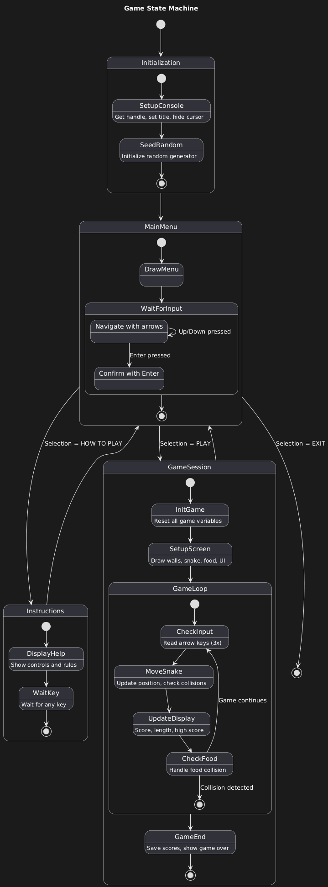
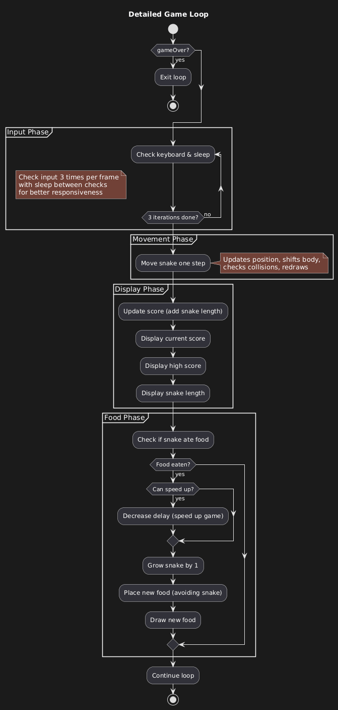

# Assembly Snake Game

A classic Snake game written in x64 Assembly (MASM) for Windows.

## How to Play

- Use **arrow keys** to move
- Eat food `*` to grow
- Avoid walls and yourself
- Game speeds up as you grow

## Building

Requires Visual Studio 2022 with MASM for x64.

1. Open `Snake.sln` → Build (F7) → Run (F5)

## Architecture Overview

<h3 align="center">Game States</h3>

  

<h3 align="center">Main Program Flow</h3>

  

<h3 align="center">Game Loop</h3>

Each frame: check input (3x for responsiveness) → move snake → check collisions → update display.

  

### Core Systems

| System | Description | Diagram |
|--------|-------------|---------|
| Movement | Snake moves by shifting body segments through an array | [View](Assets/3-Snake-Movement.png) |
| Body Shifting | Array-based segment management | [View](Assets/15-Body-Segment-Shifting.png) |
| Collisions | Wall, self, and food collision detection | [View](Assets/4-Collision-Detection-System.png) |
| Input | Arrow keys with 180° turn prevention | [View](Assets/5-Keyboard-Input.png) |
| Food | Random spawn avoiding snake body | [View](Assets/6-Food-System.png) |
| Menu | Adapts based on play history | [View](Assets/2-Menu-System.png) |

### Technical Assets

| Diagram | Description |
|---------|-------------|
| [Data Structures](Assets/12-Data-Structures-And-Memory-Layout.png) | Memory layout and variables |
| [Call Hierarchy](Assets/14-Call-Hierarchy.png) | Procedure dependencies |
| [Drawing System](Assets/9-Drawing-System.png) | Console rendering |
| [Score System](Assets/7-Score-And-Display-System.png) | Score calculation and display |
| [Initialization](Assets/8-Initialization-System.png) | Game state reset |
| [Windows API](Assets/16-Windows-API-Integration.png) | External API usage |
| [Game Over](Assets/10-Game-Over-And-Instructions.png) | End screens |

## Technical Details

- **Platform:** Windows 10/11
- **Language:** x64 Assembly (MASM)
- **Rendering:** Windows Console API
- **RNG:** C runtime (`rand`, `srand`)
